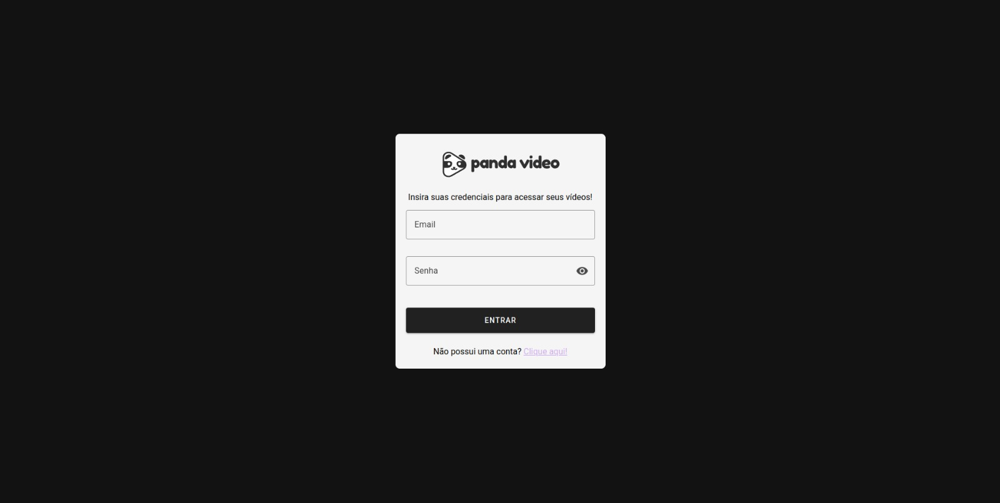
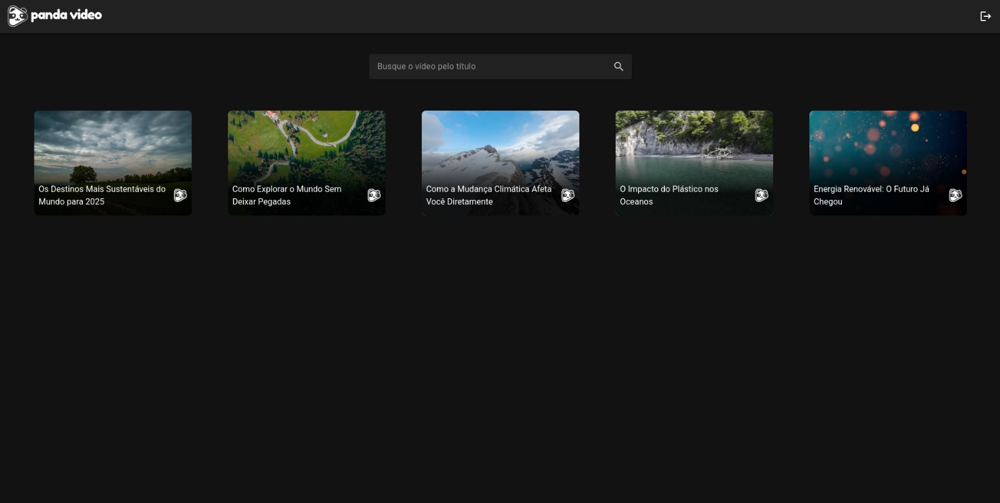
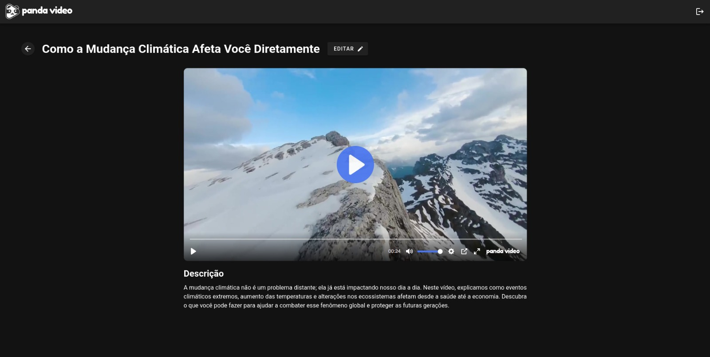
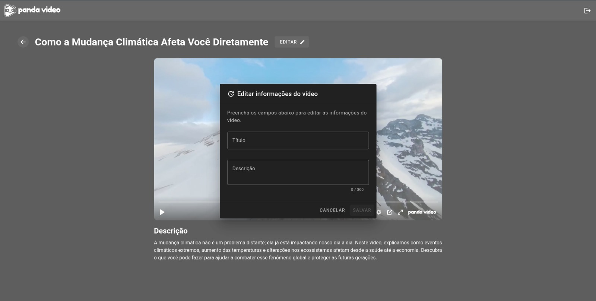

# 🐼 Desafio Panda Front

Este projeto consiste no desenvolvimento de uma aplicação frontend utilizando **Vue.js** e **Vuetify**. A aplicação deverá conter três páginas principais: Login, HomePage e VideoPage, implementando funcionalidades como autenticação, listagem e exibição de vídeos.

## 🛠️ Tecnologias utilizadas

- Vue.js
- Vuetify
- Pinia

## 💡 Execução

Após clonar o repositório, acesse a pasta do projeto e execute os comandos abaixo:

```bash
npm install
npm run dev
```

Acesse http://localhost:5173 para visualizar a aplicação.

## Prints do projeto








